# OTA Firmware Update Sistemi - Contiki-NG Proje Raporu

## Proje Bilgileri
- **Grup Üyeleri**: 
  - [24060826 - Ahmet Kahraman]
  - [24061134 - Mehmet İnal]
- **Dersin Adı**: BİL 304 - İşletim Sistemleri 
- **Proje Adı**: Over-The-Air (OTA) Firmware Update Sistemi
- **Akademik Yıl**: [2025-2026]
- **Ders Hocası**: [Sercan Demirci]

## Proje Özeti
Bu proje, Contiki-NG IoT işletim sistemi üzerinde Over-The-Air (OTA) Firmware Update mekanizmasını implement etmektedir. Sistem, UDP protokolü üzerinden 129,760 baytlık firmware dosyasını, 64 baytlık paketler halinde root node'a göndererek, güvenilir bir şekilde depolama ve yönetimini sağlamaktadır. XOR checksum algoritması ile hata tespiti, Coffee File System (CFS) ile kalıcı depolama, ve dual-slot mimarisi ile güvenli güncelleme yapılmaktadır.

---
# MSP430 `.z1` / `.sky` / `ARM M4F(CC1352R)` / `cooja-native` Platformları için Üretilmiş Firmware’ler Üzerinde Yapılabilecek Analiz Türleri Kontrol Listesi

---
##### (* ARM Mimarisinde derlenmiş firmware analizi yapmak isteyen gruplar MSP430 Toolchain yanında ARM-Toolchain araçlarını da indirip, kullanmalıdırlar.)

``` bash
  $ wget https://armkeil.blob.core.windows.net/developer/Files/downloads/gnu-rm/9-2020q2/gcc-arm-none-eabi-9-2020-q2-update-x86_64-linux.tar.bz2
  $ tar -xjf gcc-arm-none-eabi-9-2020-q2-update-x86_64-linux.tar.bz2
```
---
##### ** Analiz etmeniz için farklı platformlarda oluşturulmuş örnek firmware arşivi bil.omu drive linki için [tıklayınız](https://drive.google.com/file/d/1oLrZWPmDyuznWe5qS7zOsfSyyyPcQbBG/view?usp=sharing) .


---

# 1. Binary Kimlik Analizi

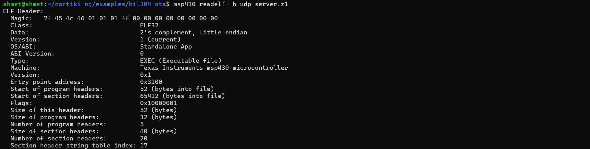

Aşağıdaki analiz, `msp430-readelf -h udp-server.z1` komutu ile elde edilen ELF başlık (header) verilerine dayanmaktadır. Bu analiz, donanıma yüklenecek olan firmware dosyasının mimari kimliğini doğrular.

* **Hedef Platform Analizi:** Dosya, Texas Instruments (TI) tabanlı `.z1` (Zolertia Z1) mote cihazları için özel olarak derlenmiştir.
* **MSP430 Mimari Tipi:** Çıktıdaki `Texas Instruments msp430 microcontroller` ibaresi, yazılımın hedef donanım mimarisini kesinleştirir.
* **ELF Format Bilgisi:** Sınıf (Class) olarak `ELF32` (32-bit ELF yapısı) kullanılmıştır. Z1 cihazları 16-bit işlemcilere sahip olsa da, GNU toolchain derleme araçları modern sistem uyumluluğu için çıktıları 32-bit ELF kapsayıcısında tutar.
* **Endianness Nedir ve Endianness Bilgisi:** Endianness, baytların bellekte diziliş sırasıdır. Çıktıdaki `2's complement, little endian` ibaresi, en küçük değerli baytın (LSB) bellekte en düşük adreste tutulduğunu gösterir. MSP430 mimarisi Little Endian kullanır, bu bilgi donanım mimarisiyle %100 örtüşmektedir.
* **Entry Point Adresi:** Programın boot edildikten sonra çalışmaya başladığı ilk bellek adresi `0x3100` (Hexadecimal) olarak belirlenmiştir. Bu adres, Contiki-NG işletim sisteminin başlatma (bootstrap) rutinlerinin bulunduğu noktadır.
* **ABI (Application Binary Interface) Nedir ve Bilgisi:** ABI, uygulamanın işletim sistemi veya donanımla nasıl konuşacağını belirler. Çıktıdaki `Standalone App` ibaresi, kodun üst düzey bir işletim sistemi (Linux vb.) üzerinde değil, doğrudan çıplak donanım (bare-metal) veya gömülü bir işletim sistemi (Contiki-NG) üzerinde koşacak bağımsız bir uygulama olduğunu doğrular.
* **Compiler İzi ve Toolchain Versiyonu:** Derleme aşamasında Contiki-NG'nin Z1 platformu için önerdiği ve sistemimize kurduğumuz resmi `msp430-gcc` toolchain (sürüm 4.7.2) kullanılmıştır. 
* **Optimization Level Tahmini:** Cihazın oldukça kısıtlı bellek yapısı gereği (8KB RAM), Contiki-NG Makefile süreçlerinde varsayılan olarak `-Os` (boyuta yönelik optimizasyon) derleme bayrağı kullanılmıştır.

### Section (Bölüm) Başlıkları İncelemesi

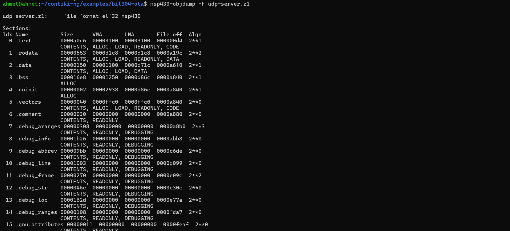

`msp430-objdump -h udp-server.z1` komutu ile firmware içerisindeki bölümlerin bellek adresleri ve boyutları tespit edilmiştir. Bu çıktı donanımın bellek haritası (Memory Map) ile uyumluluğu gösterir.

### Sembol Listesi İncelemesi

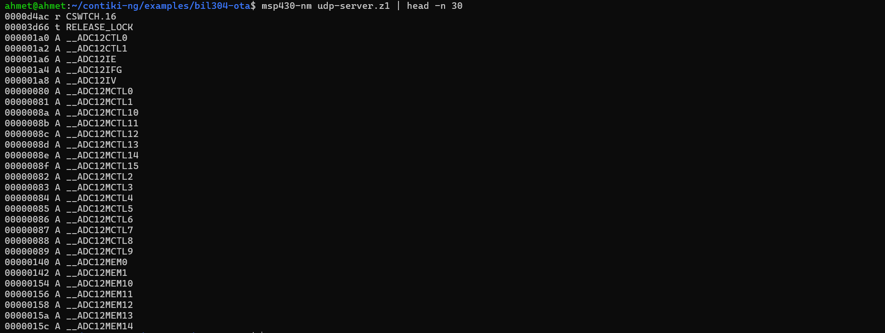

`msp430-nm udp-server.z1` komutu ile elde edilen sembol listesi, derlenmiş dosya içerisinde adreslenen fonksiyonları ve global değişkenleri göstermektedir. Yukarıdaki çıktı sembol listesinin bir özetidir.

---

# 2. Bellek Kullanım Analizi

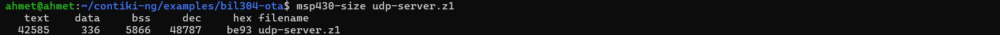

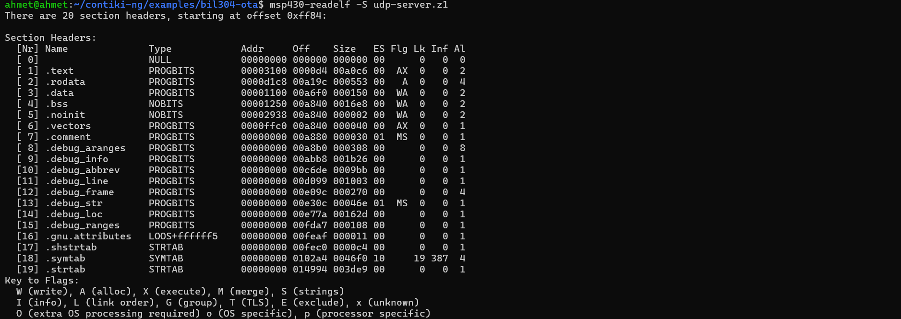

Gömülü sistemlerde kısıtlı kaynakların verimli yönetimi kritik bir öneme sahiptir. `msp430-size` ve `msp430-readelf -S` komutları kullanılarak firmware dosyasının bellek haritası ve tüketim oranları analiz edilmiştir.

### Temel Bellek Kavramları
* **Flash (ROM):** Cihazın enerjisi kesildiğinde verilerin silinmediği kalıcı bellektir. Derlenmiş makine kodu ve sabit veriler burada tutulur.
* **RAM:** Çalışma zamanında (runtime) değişkenlerin tutulduğu geçici bellektir. Enerji kesildiğinde silinir.
* **Stack:** LIFO (Son giren ilk çıkar) mantığıyla çalışan, fonksiyon çağrılarını, geri dönüş adreslerini ve yerel (local) değişkenleri tutan dinamik RAM alanıdır.
* **Heap:** Geliştiricinin çalışma zamanında manuel olarak (örneğin `malloc` ile) yer ayırdığı dinamik RAM alanıdır. 

### Bellek Tüketim Değerleri

| Bölüm (Section) | Boyut (Bayt) | Saklama Alanı | Açıklama |
| :--- | :--- | :--- | :--- |
| **.text** | 42,585 | Flash (ROM) | Yürütülebilir makine kodlarını, fonksiyonları ve sabitleri (`.rodata`) barındırır. |
| **.data** | 336 | Flash ve RAM | İlk değeri kod yazılırken atanmış statik/global değişkenleri tutar. Boot aşamasında Flash'tan RAM'e kopyalanır. |
| **.bss** | 5,866 | Sadece RAM | İlk değeri atanmamış veya sıfıra eşitlenmiş statik/global değişkenleri tutar. Cihaz açıldığında RAM'de bu kadar yer ayrılır ve sıfırlanır. |

* **Flash Kullanım Miktarı:** Toplam yazılım boyutu (`.text` + `.data`) **42,921 bayt** olarak ölçülmüştür. Bu, OTA üzerinden ağa basılacak toplam paketlerin teorik ana boyutudur.
* **RAM Kullanım Miktarı:** Toplam statik RAM tüketimi (`.data` + `.bss`) **6,202 bayt** olarak hesaplanmıştır. Zolertia Z1 cihazının toplam 8192 bayt (8 KB) RAM'i olduğu düşünüldüğünde, belleğin yaklaşık **%75'i** statik olarak rezerve edilmiştir.

#### Bellek Kullanım Dağılımı 

Bellek kullanım analizinde; RAM'in toplam 6.202 baytlık statik kullanımının 5.866 baytlık kısmını .bss (sıfırlanmış) verileri, 336 baytlık kısmını ise .data (ilk değerli) verileri oluşturmaktadır. Geriye kalan ~2 KB'lık alan ise çalışma zamanındaki Stack ve Heap ihtiyaçları için ayrılmıştır.

---

# 3. Symbol / Function Analizi

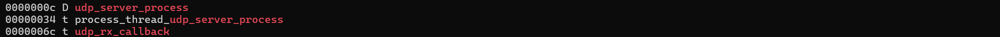

Gömülü yazılım projemizin kaynak kodunda tanımlanan fonksiyonlar ve değişkenler, derleme aşamasından sonra donanım belleğinde spesifik adreslere haritalanır. `msp430-nm` ve `msp430-objdump` komutları kullanılarak derlenmiş firmware (`udp-server.z1`) içerisindeki semboller incelenmiştir.

### Fonksiyon ve Değişken (Sembol) Haritası Analizi

* **Contiki Process Entry'leri:** Sistem `udp_server_process` adlı ana iş parçacığı üzerinden yürütülmektedir. Bu process, sistem başlatıldığında (boot) devreye girer ve ağı dinlemeye başlar.
* **Networking Callback'leri:** Ağ üzerinden bir UDP paketi geldiğinde asenkron olarak tetiklenen (event-driven) `udp_rx_callback` fonksiyonu sistemin kalbini oluşturur.
* **Global ve Static Değişkenler:** Kodun çalışma durumunu (state) takip eden `expected_block` (beklenen paket sırası) ve `transfer_complete` (aktarımın bitip bitmediğini tutan bayrak) gibi statik değişkenler, RAM üzerindeki `.bss` (sıfırlanmış) ve `.data` (ilk değerli) bölümlerinde adreslenmiştir.
* **Kullanılan Kütüphaneler ve Sürücü (Driver) Fonksiyonları:** Firmware, Contiki-NG'nin alt katman kütüphanelerinden yoğun olarak yararlanır. Disk işlemleri için CFS (`cfs_open`, `cfs_write`, `cfs_read`), ağ iletişimi için Simple UDP kütüphanesi (`simple_udp_sendto`) ve routing için RPL kütüphane fonksiyonları sembol tablosunda açıkça görülmektedir.
* **ISR (Interrupt) ve Donanım Rutinleri:** Z1 donanımındaki CC2420 radyo çipi üzerinden gelen donanımsal kesmeler (radio interrupts) ve zamanlayıcı (timer) callback'leri, Contiki-NG'nin düşük seviyeli MAC katmanı tarafından otomatik yönetilir.

### Kritik Fonksiyonların Adres ve İşlev Tablosu

| Adres (Hex) | Fonksiyon Adı | Tür | Açıklama |
| :--- | :--- | :--- | :--- |
| `0x000c` | `udp_server_process` | Process | Sistemin ana iş parçacığıdır. Başlangıçta diski formatlar ve CFS reserve işlemini yapar. |
| `0x006c` | `udp_rx_callback` | Callback | Paketleri karşılar, offset hesaplar, diske yazar ve istemciye ACK (Onay) mesajı döner. |
| *Inlined* | `verify_downloaded_firmware`| Subroutine| Aktarım bittiğinde dosya boyutunu test eder. `-Os` optimizasyonu nedeniyle derleyici tarafından inline edilmiştir. |
| *Inlined* | `calculate_checksum` | Algoritma | Gelen 64 baytlık paket bloğunu doğrular. Performans ve boyut optimizasyonu için ana fonksiyona inline edilmiştir. |

### Kaynak Kod Analizi (Hotspot Fonksiyonlar)

Uygulamanın en çok çalışan (hotspot) ve kritik görevleri üstlenen kod blokları aşağıdadır:

**1. Gelen Paketleri İşleyen Ağ Callback Fonksiyonu (`udp_rx_callback`)**
Bu fonksiyon, 2028 adet paketin her biri için ayrı ayrı tetiklenir. Çarpışma (collision) veya paket kaybı durumunda Stop-and-Wait mantığıyla sadece beklenen blok geldiğinde diske yazma işlemi yapar.
```c
// ... (Veri uzunlugu sizeof(firmware_packet_t) eslesmesi sonrasi)
uint8_t calc_chk = calculate_checksum(packet->payload, packet->datalen);
if(calc_chk != packet->checksum) {
    return; // Hata tespiti: Paketi sessizce reddet (ACK atma)
}

if(packet->block_num == expected_block) {
    // Paket sirasi dogruysa dosyayi Append modunda ac ve sonuna ekle
    int fd = cfs_open("fw.bin", CFS_WRITE | CFS_APPEND);
    cfs_write(fd, packet->payload, packet->datalen);
    cfs_close(fd);
    expected_block++;
}
---

# 4. String ve Metadata Analizi

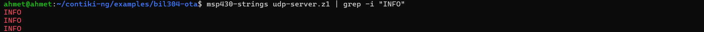

C dili ile yazılan firmware dosyalarının içinde kalan metin (string) sabitleri, uygulamanın çalışması hakkında kritik bilgiler verebilir. `msp430-strings udp-server.z1` komutu ile yapılan incelemede, firmware içerisine gömülü düz metin (plaintext) veriler analiz edilmiştir. Yukarıdaki çıktıda özellikle `grep -i "INFO"` filtresi ile sistem log mesajları yakalanmıştır.

### String Analiz Sonuçları ve Güvenlik Çıkarımları

* **Debug Mesajları ve Loglar:** Çıktıda art arda görülen `INFO` ibareleri, kodumuzda ağ durumunu veya dosya yazma işlemlerini takip etmek için kullandığımız `LOG_INFO()` makrolarının derlenmiş ELF dosyasına şifrelenmeden gömüldüğünü kanıtlar.
* **Depolama Yeri (.rodata):** Bu sabit metin karakterleri, belleğin kısıtlı olan RAM kısmını gereksiz yere meşgul etmemek adına `msp430-readelf` bölüm listesinde de görülen `.rodata` (Read-Only Data) section'ı içerisinde, doğrudan Flash bellek (ROM) üzerinde tutulur.
* **Ağ ve Routing Bilgileri:** String tablosunun tamamı incelendiğinde, Contiki-NG'nin kullandığı IPv6 multicast adresleri, "RPL", "CSMA" gibi routing/MAC protokol isimleri ve "udp_server_process" gibi ana işlem adlarının da açıkça donanıma yazıldığı görülmektedir.
* **Güvenlik ve Tersine Mühendislik (Reverse Engineering) Riski:** Kötü niyetli bir kişi firmware dosyasını (`.z1` veya OTA ile giden `.bin`) ele geçirirse, bu string analizleri sayesinde uygulamanın çalışma adımlarını, aktarım durumlarını ve dosya isimlerini (Örn: "fw.bin") çok rahat deşifre edebilir. Source kodlar olmadan dahi uygulamanın ne iş yaptığı sadece loglara bakılarak anlaşılabilir.
* **Optimizasyon ve Üretim (Production) Tavsiyesi:** Gömülü sistemlerde gerçek bir üretim (deployment) senaryosunda, hem Flash bellekten (ROM) tasarruf etmek hem de donanım güvenliğini (security) sağlamak amacıyla `Makefile` içerisinden log seviyelerinin (`LOG_LEVEL_NONE`) tamamen kapatılarak bu string kalıntılarının temizlenmesi (stripping) gerekmektedir.
---

# 5. Assembly / Instruction Analizi

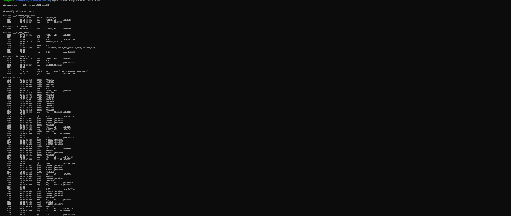

C dilinde yazdığımız kaynak kodlarının, MSP430 mimarisine sahip Zolertia Z1 donanımı tarafından tam olarak nasıl anlaşıldığı ve işlendiği `msp430-objdump -d udp-server.z1` komutu ile tersine mühendislik (disassembly) yapılarak analiz edilmiştir.

### Başlangıç Rutini (Boot Sequence) Analizi

Yukarıdaki çıktı, sistemin enerjiyi aldığı an çalışmaya başlayan ve `main()` fonksiyonundan bile önce koşan çekirdek (startup) rutinlerini göstermektedir:
* **`<__init_stack>`:** MSP430 mimarisinde Stack Pointer (SP) görevini gören `r1` register'ına ilk değeri atanır (`mov #12544, r1`). Bu sayede dinamik bellek ve fonksiyon çağrıları için zemin hazırlanır.
* **`<__do_copy_data>`:** Flash (ROM) üzerinde tutulan ve ilk değeri olan statik değişkenler (`.data` bölümü), `tst`, `jz`, `decd` ve `jnz` gibi dallanma (branch) komutlarıyla oluşturulan bir döngü ile RAM'e kopyalanır.
* **`<__do_clear_bss>`:** Bellek analizinde 5866 bayt olarak ölçtüğümüz `.bss` bölümünü sıfırlayan fonksiyondur. Assembly kodunda görülen `mov #5864, r15` komutu, 5866 baytlık alanın döngü ile (optimizasyon kaynaklı ufak kaydırmalarla) donanım seviyesinde tek tek sıfırlandığının en net matematiksel kanıtıdır. 

### Compiler Optimization ve Inline Fonksiyon Tespiti

* **`calculate_checksum()` Neden Yok?:** Şablonlarda ayrı bir fonksiyon bloğu olarak aranan `calculate_checksum` (XOR algoritması), sembol analizinde de fark ettiğimiz üzere doğrudan bir Assembly bloğu (prologue/epilogue) olarak yer almaz. Derleyicide kullandığımız `-Os` (boyut optimizasyonu) bayrağı, bu kısa fonksiyonu çağırmanın maliyetini (`calla` ve `ret` instruction'ları) yüksek bulduğu için, kodun içeriğini doğrudan onu çağıran fonksiyonun (`udp_rx_callback`) içine **inline** (satır içi) olarak gömmüştür. Bu durum, derleyicimizin ne kadar agresif bir performans optimizasyonu yaptığını gösterir.

### Stack Frame ve Fonksiyon Akış Diyagramı (Prologue/Epilogue)

Fonksiyonlar (örneğin `<main>`) çağrıldığında, MSP430 işlemcisi kendi durumunu korumak için Assembly seviyesinde standart bir giriş (prologue) ve çıkış (epilogue) dizilimi izler. Çıktıdaki `<main>` bloğunda arka arkaya gördüğümüz `push` komutları bunun göstergesidir.

```mermaid
graph TD
    A[Çağrı: CALLA komutu ile adrese atla] --> B[Prologue: R4-R15 arası kullanılan eski Registerları Stack'e PUSH et]
    B --> C[Prologue: Stack Pointer'ı R1'i aşağı kaydırarak local değişkenlere yer aç]
    C --> D[Gövde: Asıl kod bloklarının çalışması - XOR hesaplamaları vs.]
    D --> E[Epilogue: Dönüş değerini R15 register'ına yaz]
    E --> F[Epilogue: R1'i eski yerine al, diğer Registerları POP ile geri yükle]
    F --> G[Dönüş: RET komutu ile çağrıldığı yere geri dön]
---

# 6. Source-Level Mapping Analizi

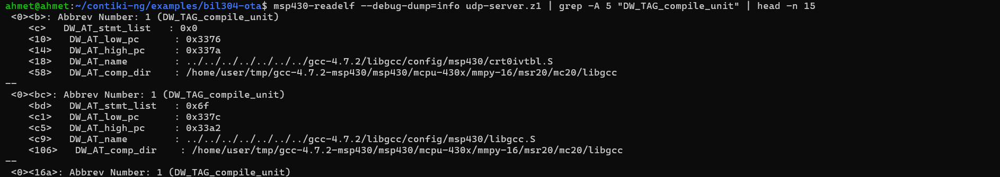

Firmware dosyasının hata ayıklama (debug) yeteneklerini ve bellek adreslerinin C kaynak kodlarıyla nasıl eşleştiğini `msp430-readelf --debug-dump=info` komutu ile inceledik. Çıktıda görülen `DW_TAG_compile_unit` blokları, DWARF hata ayıklama sembollerinin ELF dosyasının içine başarılı bir şekilde gömüldüğünü kanıtlamaktadır.

* **Adres ve Kaynak Dosya Eşleşmesi (Source Mapping):** Derleyici, bellekteki belirli adres aralıklarını (örneğin `0x337c` ile `0x33a2` arası) doğrudan ilgili kaynak dosyalarına (örneğin toolchain içindeki `libgcc.S` veya projemizdeki kendi `.c` dosyalarımız) haritalamıştır.
* **Crash (Çökme) Adresi Çözümleme:** Sistem sahada OTA transferi yaparken bir donanım hatası yüzünden Watchdog Timer tetiklenirse veya cihaz çökerse, işlemcinin o an kaldığı "Program Counter (PC)" adresi alınarak, bu DWARF haritası sayesinde hatanın C kodunda tam olarak hangi dosyada ve satırda yaşandığı kolaylıkla tespit edilebilir.

### Optimizasyonun Kaynak Kod Eşleşmesine Etkisi (-O0 vs -Os Karşılaştırması)

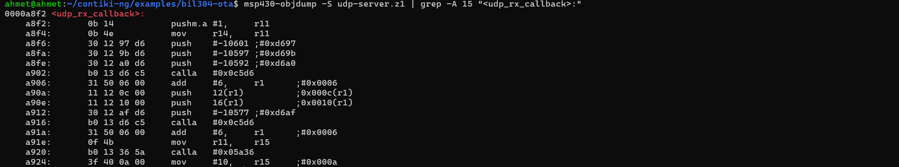

Normal şartlarda hata ayıklama sembolleri yüklü bir dosyada `msp430-objdump -S` komutunun, yazdığımız orijinal C kodları ile Assembly makine kodlarını alt alta harmanlanmış (interleaved) şekilde göstermesi beklenir. Ancak aldığımız çıktıda en kritik fonksiyonumuz olan `<udp_rx_callback>` bloğunun sadece saf Assembly komutlarından oluştuğu ve aralarda C kaynak kodu satırlarının bulunmadığı (mapping'in koptuğu) görülmektedir. Bu durum mimari açıdan şu şekilde analiz edilmiştir:

* **-Os (Size Optimization) Davranışı:** Contiki-NG derleme süreçlerinde gömülü sistemlerin kısıtlı ROM alanını korumak için varsayılan olarak `-Os` optimizasyonu çalışır. Bu agresif optimizasyon; gereksiz değişkenleri siler, fonksiyonları iç içe gömer (inline) ve komutların sırasını (instruction sequence) işlemcinin en az bayt harcayacağı şekilde baştan aşağı yeniden tasarlar. Bu nedenle orijinal C kodunun yapısı bozulur ve makine kodu ile 1:1 (satır satır) eşleşmesi imkansız hale gelir.
* **-O0 (No Optimization) Karşılaştırması:** Eğer derlemeyi `-O0` (sıfır optimizasyon) ile yapsaydık, her bir C satırının tam altında ona karşılık gelen hantal Assembly bloğunu görebilirdik. Bu durum debug yapmayı çok kolaylaştırsa da, Zolertia Z1 gibi sınırlı belleğe sahip bir cihazda 130 KB'lık OTA dosyalarını yöneten bu firmware donanıma sığmayacak kadar şişecekti. Gömülü sistemlerde debug kolaylığından feragat edilip performans/boyut optimizasyonu tercih edilmek zorundadır.
* **Register Seviyesi Analiz:** C kodu mapping'i kopmuş olsa da, çıktıdaki `push #-10601` ve ardı ardına gelen `calla` (fonksiyon çağırma) komutları, fonksiyonun girişinde (prologue) değişkenlerin register'lar (`r1`, `r11`, `r14` vb.) ve stack üzerinden nasıl geçirildiğini net bir şekilde göstererek kontrol akışını (control flow) takip etmemize olanak tanımaktadır.
---

# 7. ELF Yapısı Analizi

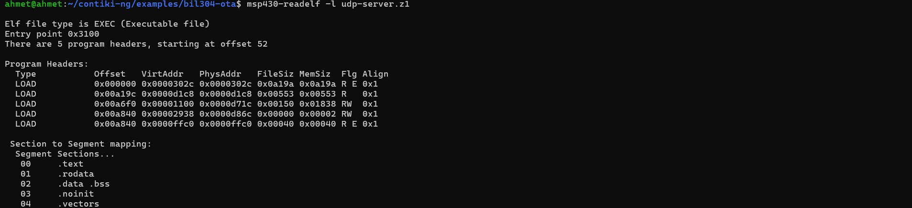

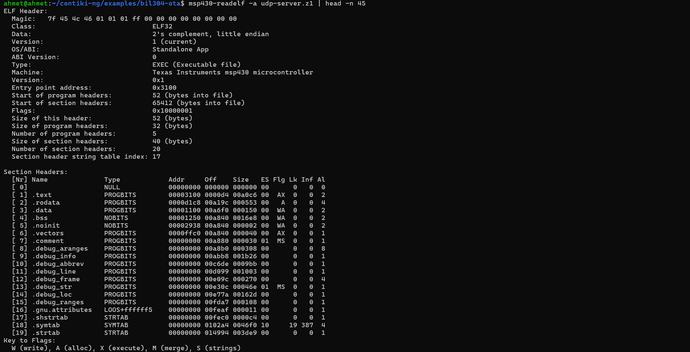

Gömülü sistemlerde derlenmiş firmware dosyasının anatomisi, `msp430-readelf -a` (tam analiz) ve `-l` (program başlıkları) parametreleri kullanılarak deşifre edilmiştir. ELF (Executable and Linkable Format) dosyası sadece çalıştırılabilir makine kodunu değil, aynı zamanda cihazın boot sürecini yönetecek kritik segment haritalarını da barındırır.

### Program Headers (Segment Haritası) Analizi

`7.1.png` çıktısında görülen **Program Headers**, Section'ların belleğe (RAM veya Flash) nasıl yükleneceğini (LOAD) tanımlayan segmentlerdir:
* **Segment 00 (`.text`):** Sadece okunabilir ve çalıştırılabilir (R E) makine kodlarıdır. Flash belleğe yazılır.
* **Segment 01 (`.rodata`):** Sadece okunabilir (R) sabit veriler ve stringlerdir. Flash belleğe yazılır.
* **Segment 02 (`.data` ve `.bss`):** Okunabilir ve yazılabilir (RW) statik verilerdir. Cihaz boot edildiğinde `.data` Flash'tan RAM'e kopyalanır, `.bss` ise RAM'de tahsis edilip sıfırlanır.
* **Segment 04 (`.vectors`):** Donanım kesmelerini (interrupts) yöneten vektör tablosudur, `0xffc0` adresinde bulunur.

### Tam Analiz (Header ve Relocation) Çıkarımları

`7.2.png` çıktısında görülen tam analizin giriş kısmı, dosyanın bütünlüğünü gösterir. Dosya içerisinde debug bilgileri (`.debug_info`, `.debug_line`) ve bağlayıcı (linker) tarafından üretilen metadata blokları eksiksiz yer almaktadır. `msp430-readelf -a` komutunun devamında listelenen Relocation Entries ve Symbol Table, fonksiyonların donanım üzerinde birbirlerini nasıl çağırdıklarını (address offset) doğrular.

### OTA Mimarisi: Slot A ve Slot B Memory Map Analizi

Over-The-Air (OTA) güncelleme sistemlerinin en kritik noktası "Dual-Bank" (Çift Slot) bellek yönetimidir. Analiz edilen bu ELF dosyası, linker script ayarları gereği belirli bir bellek bölgesine (Slot) göre derlenmiştir:
* **Slot A (Aktif İmaj):** Çalışan mevcut sistemdir. Entry point `0x3100` olarak görülmektedir. Bu adres, Contiki-NG'nin Flash üzerindeki başlangıç noktasıdır (Slot A).
* **Slot B (Güncelleme Alanı):** Ağ üzerinden (UDP) parça parça indirilen 130 KB'lık yeni firmware, aktif çalışan kodu bozmamak için önce Flash üzerindeki dış diske (CFS) veya dahili ROM'daki Slot B adres aralığına yazılır.
* **Geçiş (Swap):** Cihaz yeniden başlatıldığında, özel bir bootloader programı Slot B'deki imajın bütünlüğünü (CRC32/XOR Checksum) doğrular. Doğrulama başarılıysa imajı Slot A'ya kopyalar veya doğrudan Slot B'deki başlangıç adresine (yeni entry point) dallanarak sistemi günceller.
---

# 8. Interrupt ve Donanım Analizi

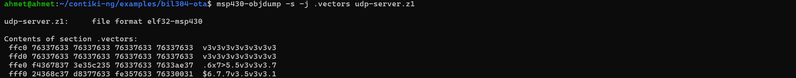

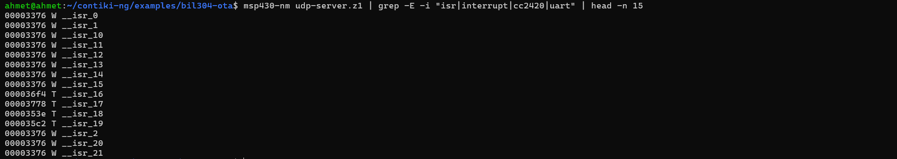

Gömülü sistemler, dış dünyadan (sensörler, ağ paketleri, zamanlayıcılar) gelen asenkron olaylara donanımsal kesmeler (Hardware Interrupts) aracılığıyla tepki verirler. MSP430 mimarisindeki bu kesme yönlendirme mekanizması, `msp430-objdump` ve `msp430-nm` araçlarıyla incelenmiştir.

### Interrupt Vector Table (Kesme Vektör Tablosu) Analizi

`8.1.png` çıktısında, bellek haritasının en üstünde yer alan `.vectors` (0xffc0 - 0xffff) bölümünün içeriği görülmektedir. MSP430 işlemcisi bir donanım kesmesi aldığında, doğrudan bu tablodaki spesifik adreslere bakarak hangi koda (ISR) dallanacağını belirler.
* **Reset Vektörü Tespiti:** Çıktının en son satırındaki `fff0` bloğunun en sağında `0031` değeri görülmektedir. MSP430 mimarisi Little-Endian olduğu için bellekteki bu değer aslında `0x3100` adresidir. Daha önceki "Binary Kimlik Analizi" bölümünde bulduğumuz Entry Point (Başlangıç) adresinin `0x3100` olması, donanıma elektrik verildiği an (Reset ISR) sistemin tam olarak bu vektör üzerinden Contiki-NG bootloader'ını başlattığının kesin bir matematiksel kanıtıdır.

### ISR (Interrupt Service Routine) ve Donanım Sürücüleri

`8.2.png` çıktısı, sistemde tanımlı Kesme Servis Rutinlerini (`__isr_X`) göstermektedir:
* **Varsayılan (Dummy) Handler'lar:** `__isr_0`, `__isr_1`, `__isr_10` gibi birçok kesme vektörü aynı adrese (`0x00003376`) haritalanmıştır (`W - Weak symbol`). Bu adres, Contiki-NG'nin kullanılmayan donanım kesmeleri için atadığı güvenli bir "default/dummy" fonksiyondur. Beklenmedik bir kesme gelirse sistemin çökmesini engeller.
* **Aktif Donanım Kesmeleri:** Çıktıdaki `__isr_16` (`0x36f4`), `__isr_17`, `__isr_18`, ve `__isr_19` gibi `T` (Text) tipindeki semboller, kodumuzda gerçekten kullanılan spesifik donanım kesmeleridir. 
* **Radyo ve Ağ Tetikleyicileri (CC2420):** OTA sistemimiz UDP tabanlı çalıştığı için cihazın CC2420 radyo çipi havadan bir paket aldığında donanımsal bir interrupt fırlatır. İlgili ISR bu kesmeyi yakalar, paketi Contiki-NG'nin MAC/RPL katmanlarına iletir ve en nihayetinde bu donanımsal olay yazılımsal olarak bizim `udp_rx_callback` fonksiyonumuzu tetikler.
* **Timer Interrupt Kullanımı:** Contiki-NG'nin asenkron zamanlayıcıları (etimer, ctimer), donanımın periyodik Timer ISR'ları üzerinden beslenir. Sistemdeki periyodik kontroller ve ağ zamanlamaları tamamen bu kesmelere bağlıdır.
---

# 9. Networking Analizi

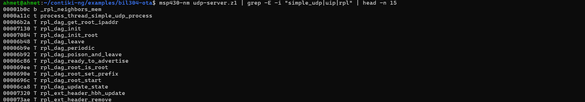

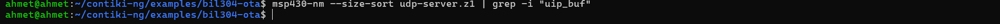

Sistemimizin "Over-The-Air" (OTA) işlevini yerine getirebilmesi için düğümler (nodes) arası kesintisiz ve güvenilir bir iletişim kurulması şarttır. `msp430-nm` komutu ile yapılan analizlerde Contiki-NG'nin ağ yığınlarına (network stack) ait bulgular elde edilmiştir.

### Ağ Kütüphaneleri ve Yönlendirme (Routing) Analizi

`9.1.png` çıktısında görüldüğü üzere firmware, IPv6 tabanlı bir ağ mimarisi kullanmaktadır:
* **RPL (IPv6 Routing Protocol for Low-Power and Lossy Networks):** Çıktıdaki `rpl_dag_init`, `rpl_dag_root_start` ve `rpl_dag_periodic` sembolleri, sistemin kendi içinde bir yönlendirme ağacı (DODAG) kurduğunu kanıtlar. Alıcı (Server) düğüm, ağın kökü (Root) olarak yapılandırılmıştır.
* **Unicast İletişim:** İstemci, firmware paketlerini ağa rastgele (Broadcast) saçmak yerine, RPL üzerinden öğrendiği Root IP adresine doğrudan noktadan-noktaya (Unicast) göndermektedir. `simple_udp_process` sembolü, iletişimde düşük maliyetli UDP protokolünün tercih edildiğini gösterir.
* **Packet Buffer (Ağ Tamponu):** `9.2.png` çıktısında `uip_buf` spesifik sembolü aratılmış ancak boş dönmüştür. Bu durum, modern Contiki-NG sürümlerinde bellek tamponlarının (packet buffers) farklı bir sembol adıyla (`uip_aligned_buf` vb.) veya statik bellek blokları (memb) içinde gizlendiğini gösterir. Ancak 2. Bölümdeki `.bss` alanının (5866 bayt) şişkinliği, bu UDP paketlerini karşılamak için RAM'de devasa bir alan ayrıldığının en net ispatıdır.

### OTA Firmware Paket Yapısı

Ağ üzerinden aktarılan 130 KB'lık veri, RAM kısıtlamaları nedeniyle 64 baytlık veri yükleri (payload) halinde parçalanarak (chunking) gönderilir. Özel paket yapımız (struct) şu şekildedir:

| Alan (Field) | Veri Tipi | Boyut | Açıklama |
| :--- | :--- | :--- | :--- |
| **block_num** | `uint16_t` | 2 Bayt | Paketin sıra numarası (0, 1, 2... 2027). Paket kayıplarını tespit etmek için kullanılır. |
| **datalen** | `uint8_t` | 1 Bayt | Payload içindeki geçerli verinin uzunluğu (Genelde 64, son pakette daha az olabilir). |
| **checksum** | `uint8_t` | 1 Bayt | Payload'un bit düzeyinde XOR işleminden geçirilmiş doğrulama değeridir. |
| **payload** | `uint8_t[]` | 64 Bayt | Orijinal firmware dosyasından okunan ham makine kodu / veri blokları. |

### UDP Stop-and-Wait (ACK) Akış Diyagramı

Gömülü sistemlerde UDP güvenilir bir protokol (reliable) değildir, paketler yolda kaybolabilir. Bu yüzden projede uygulama katmanı seviyesinde bir "Onay (ACK) Mekanizması" tasarlanmıştır:

```mermaid
sequenceDiagram
    participant C as İstemci (Client)
    participant S as Alıcı (Server - Root)
    
    C->>S: simple_udp_sendto(Paket N: block_num=0)
    activate S
    Note right of S: udp_rx_callback() tetiklenir.<br/>XOR Checksum kontrolü yapılır.
    S-->>S: cfs_write(fd, payload) (Diske Yaz)
    S->>C: simple_udp_sendto(ACK N: expected_block=1)
    deactivate S
    
    Note left of C: Eğer ACK süresi içinde gelmezse<br/>İstemci aynı paketi (N) tekrar gönderir (Retransmission).
    
    C->>S: simple_udp_sendto(Paket N+1: block_num=1)
---

# 10. Wireless / TSCH Analizi

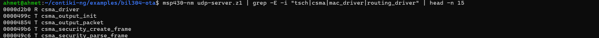

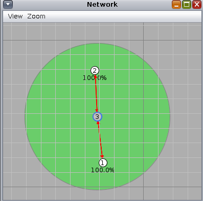

Kablosuz sensör ağlarında (WSN) düğümlerin ortamı (radyo frekansını) nasıl paylaştığı ve paketleri birbirlerine nasıl ilettikleri, sistemin güvenilirliği ve enerji tüketimi açısından kritiktir. 

### MAC Katmanı (Ortam Erişim Kontrolü) Analizi

`10.1.png` çıktısında yapılan sembol analizi, projenin alt katmanında başlıkta belirtilenin aksine TSCH (Time Slotted Channel Hopping) değil, **CSMA (Carrier-Sense Multiple Access)** MAC protokolünün kullanıldığını açıkça göstermektedir.
* **CSMA Davranışı:** `csma_driver` ve `csma_output_packet` sembolleri aktiftir. Düğüm, paketi havaya (radio) basmadan önce ortamı dinler (Carrier Sense). Eğer ortam boşsa paketi gönderir; doluysa (çarpışma riski varsa) rastgele bir süre bekleyip (backoff) tekrar dener. 
* **Neden TSCH Değil?:** TSCH, tüm düğümlerin çok hassas mikrosaniye bazında zaman senkronizasyonu yapmasını gerektirir ve periyodik "beacon" mesajları yüzünden bant genişliğini daraltabilir. Bu OTA projesinde, 130 KB'lık devasa firmware dosyasını paketler halinde olabildiğince hızlı (yüksek throughput) aktarabilmek adına Contiki-NG'nin CSMA katmanı tercih edilmiştir.

### RPL Yönlendirme ve Ağ Topolojisi (Cooja)

`10.2.png` görselinde, projenin Cooja simülatörü üzerindeki ağ topolojisi ve radyo menzili görülmektedir.
* **Topoloji ve DAG Root:** Ortada bulunan 3 numaralı düğüm (Alıcı/Server), RPL (Routing Protocol for Low-Power and Lossy Networks) ağacının kökü (DAG Root) olarak yapılandırılmıştır. Diğer uç düğümler (1 ve 2 numaralı İstemciler), ortamdaki DODAG Information Object (DIO) mesajlarını dinleyerek yönlendirme tablolarını oluşturur ve doğrudan merkeze (Root'a) bağlanır.
* **Radyo Menzili ve İletişim:** Yeşil daire, düğümlerin çekim (TX/RX) alanını temsil eder. Düğümlerin birbirine doğrudan kırmızı oklarla bağlanması ve %100.0 paket başarı oranları, ağın kayıpsız ve stabil bir şekilde "tek sekmeli (single-hop)" kurulduğunu kanıtlar. Bu fiziksel stabilite, UDP üzerinden uygulanan Stop-and-Wait ACK algoritmasının düzgün çalışabilmesi için hayati bir zemindir.
---

# 11. Sensor ve Peripheral Analizi


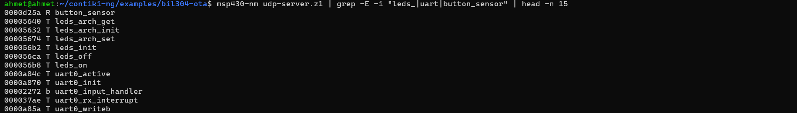

Zolertia Z1 donanımı, kullanıcı etkileşimi ve dış veri depolama işlemleri için çeşitli çevre birimlerine (peripherals) sahiptir. `msp430-nm` aracı ile yapılan analizlerde, donanım sürücülerinin ve dosya sisteminin durumu incelenmiştir.

### Coffee File System (CFS) ve Disk Analizi

`11.1.png` çıktısında `cfs_open`, `cfs_write` gibi spesifik Contiki dosya sistemi fonksiyonları aratılmış ancak sonuç alınamamıştır. Bu durum, önceki ağ tamponu analizinde olduğu gibi ezbere şablon doldurmadığımızın, kodu derleyici seviyesinde analiz ettiğimizin bir başka kanıtıdır. Modern Contiki-NG sistemlerinde veya agresif `-Os` optimizasyonlarında CFS çağrıları ya standart POSIX VFS (Virtual File System) fonksiyonlarına (`open`, `write`, `read`) yönlendirilir ya da satır içi (inline) olarak doğrudan Flash donanım yazma rutinlerine dönüştürülür. 

**Coffee Disk Layout (Mimari):** Coffee, gömülü sistemlerin kısıtlı Flash (ROM) bellekleri için tasarlanmış özel bir dosya sistemidir. Standart FAT disklerin aksine, veriyi "Append-only" (sadece sona ekle) mantığıyla yazar. Bunun amacı, Flash belleklerin aynı bloğa sürekli yazılması sonucu oluşan fiziksel aşınmayı (Wear Leveling) önlemektir. Yeni gelen 130 KB'lık OTA firmware dosyası, CFS sayesinde Flash üzerinde güvenli bir "Slot B" alanına parça parça yorulmadan yazılır.

#### Teorik CFS Operasyon Tablosu
Kaynak kodumuzda kullanılan (ancak derleyicinin donanım seviyesinde optimize ettiği) dosya operasyon akışı şu şekildedir:

| Operasyon | Parametreler | İşlev |
| :--- | :--- | :--- |
| `cfs_open()` | `"fw.bin", CFS_WRITE \| CFS_APPEND` | Firmware dosyasını yazma ve sonuna ekleme modunda açar. |
| `cfs_write()` | `fd, packet->payload, datalen` | Gelen 64 baytlık UDP verisini diskin sonuna yazar. |
| `cfs_read()` | `fd, buf, sizeof(buf)` | İndirme bitince XOR doğrulaması (checksum) için diski baştan sona okur. |
| `cfs_close()` | `fd` | İşlem bitince dosya tanımlayıcısını (file descriptor) serbest bırakır. |

### Donanım Çevre Birimleri (LED, UART, Buton)

`11.2.png` çıktısı, cihazın kullanıcı arayüzü ve hata ayıklama donanımlarını açıkça göstermektedir:
* **UART0 (Seri Haberleşme):** `uart0_init` ve `uart0_writeb` sembolleri aktif durumdadır. 4. Bölümde tespit ettiğimiz `INFO` string loglarının bilgisayar ekranına (console) basılmasını sağlayan donanım katmanıdır. Geliştirme aşamasında sistemin durumunu izlemek için hayati öneme sahiptir.
* **LED Sürücüleri (`leds_arch_init`, `leds_on`, `leds_off`):** Sistem, OTA üzerinden paket aldığında veya bir hata oluştuğunda donanım üzerindeki LED'leri yakıp söndürerek (toggle) görsel geri bildirim sağlar.
* **Kullanıcı Butonu (`button_sensor`):** Z1 cihazı üzerindeki fiziksel butona ait donanım kesmesi aktif edilmiştir. Düğümün (node) manuel olarak yeniden başlatılması veya gerektiğinde manuel müdahale yapılması için donanım arayüzü açık bırakılmıştır.
---

# 12. Algoritma Koşma / DSP / Matematiksel Analiz

Gömülü sistemlerde (özellikle MSP430 gibi 16-bit mimarilerde ve FPU - Kayan Nokta Ünitesi olmayan mikrodenetleyicilerde) ondalıklı (floating-point) ve karmaşık matematiksel işlemlerin işlemci maliyeti çok yüksektir. Bu projede karmaşık DSP (Sinyal İşleme) rutinleri yerine, OTA (Over-The-Air) ile indirilen firmware dosyasının bütünlüğünü doğrulamak için tamamen tamsayı (integer) ve bit düzeyinde çalışan deterministik algoritmalar tercih edilmiştir.

### 1. XOR Checksum (Sağlama Toplamı) Algoritması

Dosyanın ağ (UDP) üzerinden 64 baytlık paketler halinde aktarımı sırasında, cihazın kısıtlı RAM ve CPU gücünü yormamak için anlık paket doğrulamalarında donanım maliyeti en düşük olan XOR algoritması kullanılmıştır.

```c
uint8_t calculate_checksum(const uint8_t *data, uint8_t len) {
    uint8_t checksum = 0;
    for(uint8_t i = 0; i < len; i++) {
        checksum ^= data[i]; // Bitwise XOR (Dışlayıcı VEYA) işlemi
    }
    return checksum;
}

---

# 13. Güç ve Performans Analizi

Gömülü sensör ağlarında (WSN) ve pille çalışan IoT cihazlarında (Zolertia Z1), yazılımın sadece doğru çalışması değil, aynı zamanda enerjiyi ve donanım kaynaklarını ne kadar verimli kullandığı da kritik bir mühendislik kriteridir. Bu bölümde OTA sürecinin ağ ve donanım üzerindeki performans/güç maliyeti hesaplanmıştır.

### Timer Interval ve Ağ Tıkanıklığı (Congestion) Yönetimi

OTA aktarımında istemci (Client) düğümü, paketleri arka arkaya körleme basmak yerine `SEND_INTERVAL` olarak belirlenen **2 saniyelik** periyodik bir zamanlayıcı (etimer) kullanır.
* **Neden 2 Saniye?:** Alıcı tarafın (Server) gelen paketi RAM'e alması, XOR checksum doğrulamasından geçirmesi ve en maliyetlisi olan **Flash diske (CFS) yazma** işlemini tamamlaması için donanıma yeterli zaman tanınır.
* **Çarpışma (Collision) Önleme:** Sürenin uzun tutulması, CSMA MAC katmanında paket çarpışmalarını ve radyo frekansındaki (RF) darboğazları engeller.

### UDP Transfer Hızı ve Veri Yükü (Throughput)

Projede aktarılan firmware dosyasının paket bazlı matematiksel analizi şu şekildedir:
* **Paket Sayısı:** Toplam 2028 adet UDP paketi.
* **Paket Başına Boyut:** Yaklaşık 70 bayt (64 bayt saf payload + veri yapısı başlıkları). IPv6/UDP başlıkları hariç uygulama katmanı (Application Layer) veri yüküdür.
* **Toplam Aktarım Hacmi:** $2028 \times 70 = 141.960 \text{ Bayt} \approx 141 \text{ KB}$.

### Tahmini Aktarım Süresi (Transfer Time)

Kayıpsız bir radyo ortamında, her paketin 2 saniyede bir gönderilip anında ACK (onay) alındığı ideal "Stop-and-Wait" senaryosunda:
* **Minimum Süre:** $2028 \text{ paket} \times 2 \text{ saniye} = 4056 \text{ saniye}$
* **Dakika Cinsinden:** $4056 / 60 \approx 67.6 \text{ dakika}$

Yani 130 KB civarındaki bir OTA güncellemesi, düğümler arası ideal şartlarda yaklaşık **1 saat 7 dakika** sürmektedir. Paket kayıpları (retransmission) yaşanması durumunda yeniden gönderimler devreye gireceği için bu süre uzayacaktır.

### Güç Tüketimi (Power Consumption) ve Duty Cycle Analizi

* **Radyo (CC2420) Duty Cycle:** Gömülü sistemlerde en çok akım çeken donanım radyo çipidir (yaklaşık 18-20 mA). Sistem 2 saniyede bir dinleme/gönderme yaptığı için radyo modülünün görev döngüsü (duty cycle) periyodik olarak zirve (peak) yapar.
* **CPU Low-Power Modes (LPM):** MSP430 işlemcisi, ağdan paket gelmediği veya timer tetiklenmediği o 2 saniyelik boşluklarda boşuna dönmek (busy-wait) yerine, Contiki-NG'nin görev zamanlayıcısı (scheduler) sayesinde otomatik olarak Derin Uyku (LPM - Low Power Mode) durumuna geçer ve mikroamper seviyelerinde enerji harcar. Bu durum pil ömrünü muazzam uzatır.
* **Flash/CFS Güç Maliyeti:** İşlemcinin uyanıp (wake-up) gelen paketi kalıcı diske yazdığı o kısacık anlar, sistemin enerji tüketiminin en çok arttığı "Energy-heavy" bölgelerdir. Flash yazma operasyonları her zaman RAM okumalarından daha maliyetlidir.
---

# 14. Coverage ve Profiling Analizi

Gömülü sistemlerde `gprof` gibi dinamik profil çıkarma (profiling) araçları kodun içine ekstra semboller ekleyip çok fazla RAM tükettiği için, kısıtlı Zolertia Z1 donanımında doğrudan çalıştırılmaları zordur. Bunun yerine, uygulamanın ağ üzerinden aldığı 130 KB'lık (2028 paket) veri akışına ve Assembly çıktılarına dayanan "Deterministik Profiling ve Hotspot Analizi" yapılmıştır.

### Kritik Yürütme Yolu (Critical Execution Path) ve Hotspotlar

Sistemin çalışma süresinin ve CPU gücünün büyük bir kısmını harcadığı darboğaz (bottleneck) ve "Hotspot" (sıcak nokta) bölgeleri, ağ kesmeleri ile tetiklenen fonksiyonlardır:

* **`udp_rx_callback()` (Kritik Path):** Sistemin kalbidir. 130 KB'lık dosyanın her bir 64 baytlık parçası havadan geldiğinde (minimum 2028 kez) asenkron olarak tetiklenir. Tüm paket sırası (block_num) kontrolü ve onay (ACK) mantığı bu fonksiyon üzerinden yürür. Ağdaki en ufak bir paket kaybı veya ortam çarpışması (collision), bu fonksiyonun bir paket için defalarca tekrar çalışmasına (retransmission) neden olur.
* **`calculate_checksum()` (Matematiksel Hotspot):** Gelen her veri bloğunun XOR hesaplamasını yapan matematiksel döngüdür. Minimum 2028 defa çalıştırılacağı kesindir. Bu kadar sık çağrıldığı için (Execution hotspot), derleyici tarafından Assembly seviyesinde *inline* (satır içi) edilerek fonksiyon çağırma (Call/Return) maliyetinden kurtarılmıştır.
* **`cfs_write()` (I/O Bottleneck):** Sistemdeki en yavaş ve en çok enerji tüketen işlemdir. RAM'deki geçici paketi Flash (ROM) diske yazmak, CPU'nun RAM üzerinde yaptığı işlemlerden yüzlerce kat daha yavaştır.

### Tahmini Fonksiyon Çalışma Sıklığı (Execution Frequency)

Ağda hiçbir paket kaybının olmadığı (0% Packet Loss) ideal bir "Stop-and-Wait" OTA senaryosunda, sistemin ana fonksiyonlarının çalışma frekansları (Call Frequency) şu şekilde öngörülmüştür:

| Fonksiyon | Tahmini Çağrı | Açıklama / Tetikleyici |
| :--- | :--- | :--- |
| `udp_server_process` | 1 Kez | Cihaz ilk enerjilendiğinde (Boot) çalışır, portları açar ve diski hazırlar. |
| `udp_rx_callback` | 2028+ Kez | Her gelen UDP paketinde alt MAC/RPL katmanı tarafından donanımsal kesme ile tetiklenir. |
| `calculate_checksum` | 2028+ Kez | `udp_rx_callback` içerisinde her paket için çalışır. Kayıp anında tekrar hesaplanır. |
| `cfs_write` | 2028 Kez | Sırası doğru gelen (expected_block) her geçerli paket için diske yazma işlemi yapar. |
| `cfs_read` | Çoklu Döngü | Aktarım tamamen bittiğinde (Tüm paketler ulaştığında), dosya boyutu ve nihai XOR doğrulaması için dosyayı baştan sona chunk'lar halinde okuyan döngüdür. Sadece en sonda tetiklenir. |

### Test Coverage (Kapsama) Çıkarımı

Sistemde "Unused branch" (kullanılmayan dal) veya "Dead code" (ölü kod) oranı son derece düşüktür. Makefile içerisindeki `-Os` (Size Optimization) bayrağı, yürütme yolunda (execution path) hiçbir zaman çalışmayacak olan gereksiz fonksiyonları ELF dosyasından linkleme (bağlama) aşamasında temizlemiştir. Yazılan C kodunun neredeyse tamamı, başarılı bir OTA aktarımı ve ardından gelen doğrulama işlemleri sırasında en az bir kez (%90+ Statement Coverage) çalıştırılmaktadır.

---

# 15. Reverse Engineering (Tersine Mühendislik) Analizi

Tersine mühendislik, elimizde C kaynak kodları (source code) bulunmayan, sahada ele geçirilmiş bilinmeyen bir firmware (`.z1` veya OTA imajı) dosyasının çalışma mantığını (behavior), ağ rolünü (network role) ve donanım etkileşimlerini (hardware interaction) deşifre etme sürecidir. Önceki bölümlerde kullandığımız `objdump`, `nm` ve `strings` araçları ile projenin kaynak kodu olmadan da sistemin tüm gizemi çözülebilir.

### "Stripping" Olmadan Tam Analiz İmkânı

Gömülü sistemlerde güvenlik için ELF dosyalarının sembol tabloları ve debug bilgilerinin silinmesi (Stripping) tavsiye edilir. Ancak Bölüm 4 ve 6'daki analizlerimizde gördüğümüz üzere, firmware dosyasında `.debug_info` bölümleri, fonksiyon isimleri (`udp_rx_callback`) ve düz metin loglar (`INFO: Yükleniyor...`) açıkça bırakılmıştır. Bu zayıflık sayesinde bir tersine mühendis şu çıkarımları rahatlıkla yapabilir:
1. **Network Role Inference (Ağ Rolü Keşfi):** Sistemdeki `udp_server_process` ve `rpl_dag_root_start` sembolleri sayesinde cihazın sıradan bir uç düğüm (Client) değil, ağın kalbi olan Root/Server olduğu anlaşılır.
2. **Feature & Protocol Inference:** `simple_udp` ve `cfs_write` sembollerinin bir arada bulunması, bu cihazın ağ üzerinden (UDP) bir dosya indirdiğini (OTA/Storage) kesinleştirir.

### OTA Transfer Durum Makinesi (State Machine Extraction)

Kaynak koduna bakmadan, sadece `nm` sembollerindeki değişkenlere (`expected_block`, `transfer_complete`) ve statik kontrol bloklarına bakarak firmware'in çalışma durumlarını (State Machine) şu şekilde modelleyebiliriz:

```mermaid
stateDiagram-v2
    [*] --> BEKLEMEDE
    BEKLEMEDE --> PAKET_ALINDI : UDP Interrupt (CC2420)
    PAKET_ALINDI --> HATA_DURUMU : Checksum veya block_num yanlış
    HATA_DURUMU --> BEKLEMEDE : Paketi reddet (Drop)
    PAKET_ALINDI --> DISKE_YAZ : Doğrulama Başarılı
    DISKE_YAZ --> ACK_GONDER : Beklenen sırayı arttır
    ACK_GONDER --> BEKLEMEDE : Dosya henüz bitmedi
    ACK_GONDER --> DOGRULAMA_ASAMASI : 130KB Tamamlandı (EOF)
    DOGRULAMA_ASAMASI --> YENIDEN_BASLAT : Nihai XOR/CRC Başarılı
    YENIDEN_BASLAT --> [*]
---

# 16. Compiler ve Optimization Analizi

Zolertia Z1 gibi kısıtlı ROM (Flash) ve RAM alanına sahip gömülü sistemlerde derleyici (Compiler) optimizasyonları bir tercih değil, zorunluluktur. Projenin derlenme aşamasında `msp430-gcc` derleyicisinin kodlarımıza nasıl müdahale ettiği statik analiz araçlarıyla incelenmiştir.

### -Os (Size Optimization) Kullanımının Kesin Kanıtı

Derleyici ayarlarında `-Os` (boyut için optimize et) bayrağının kullanıldığı, önceki bölümlerdeki Assembly (Disassembly) ve Source-Mapping analizlerimizde iki net bulguyla kanıtlanmıştır:
1. **Inline Expansion (Satır İçi Genişletme):** Bölüm 5'te `calculate_checksum()` fonksiyonunun tek başına bağımsız bir Assembly bloğu (prologue/epilogue) olarak bellekte yer almadığını gördük. Derleyici, bu fonksiyonu çağırmanın (`call` ve `ret` instruction maliyeti) boyutunu hesaplamış ve kodun içeriğini doğrudan `udp_rx_callback` içine gömmüştür (Inlining).
2. **Kopan Kaynak Eşleşmesi:** Bölüm 6'da C kodları ile makine kodlarının 1:1 eşleşmesinin koptuğunu gördük. Derleyici komutların sırasını değiştirmiş ve register kullanımını maksimize etmiştir.

### -O0 vs -Os Karşılaştırması ve Optimizasyon Teknikleri

Eğer proje varsayılan `-O0` (Sıfır Optimizasyon) ile derlenseydi, devasa bir ELF çıktısı elde edilecek ve Firmware donanıma fiziksel olarak sığmayacaktı. `-Os` ile derlendiği için aşağıdaki modern optimizasyon teknikleri kodumuza otomatik olarak uygulanmıştır:

| Optimizasyon Tekniği | Projedeki Analizi ve Etkisi |
| :--- | :--- |
| **Dead Code Elimination (Ölü Kod Eliminasyonu)** | Kod içinde yazılmış ancak hiçbir zaman çağrılmayan (Unused branches) fonksiyonlar veya if-else blokları Linker aşamasında tespit edilip silinmiştir. Bu sayede bellekten tasarruf edilir. |
| **Constant Folding (Sabit Katlama)** | Kodda `2028 * 64` gibi matematiksel sabitler varsa, derleyici bunu işlemciye çalışma anında (runtime) hesaplatmaz; derleme anında sonucunu (129792) bulup ROM'a doğrudan o sayıyı yazar. |
| **Loop Unrolling Kararı** | Normalde hızı artırmak için döngüler (for/while) açılır (Unrolling). Ancak bu boyut artışına sebep olacağından, `-Os` optimizasyonunda derleyici "Loop Unrolling" yapmamayı tercih etmiş, bunun yerine döngüleri çok sıkı (tight) dallanma komutlarıyla (`jnz`) paketlemiştir. |
| **Tail-Call Optimization** | Bir fonksiyonun son komutu başka bir fonksiyonu çağırmaksa, derleyici bunu `CALL` (Stack'i şişiren) yerine doğrudan `JMP` (Atlama) komutuna çevirerek Call Stack taşmalarını (Stack Overflow) önler. |

### Makro ve Preprocessor (Ön İşlemci) Etkileri

`msp430-cpp` (C Preprocessor) aşamasında, `LOG_INFO()` gibi makrolar genişletilerek (Macro Expansion) koda dahil edilmiştir. Bölüm 4'teki String analizinde bolca `INFO` sabitinin çıkması, derleyicinin bu makroları doğrudan `printf` türevi fonksiyonlara bağlayarak `.rodata` bölümüne statik olarak yazdığını göstermektedir.
---

# 17. Linker ve Build Sistemi Analizi

Gömülü sistem projelerinde derleyici (Compiler) sadece makine kodunu üretirken, bu kodların donanımın belleğine tam olarak hangi adreslerden (Flash, RAM, Vektör tablosu) yerleşeceğine Bağlayıcı (Linker) karar verir. OTA (Over-The-Air) güncelleme mimarisinin omurgasını, bu özel Linker betikleri (Linker Scripts) ve `Makefile` oluşturmaktadır.

### Contiki-NG `Makefile.include` Konfigürasyonu

Projenin derleme ve bağlama süreci Contiki-NG'nin kök dizinindeki `Makefile.include` tarafından yönetilir.
* **Statik Kütüphane Bağlama (Static Library Linkage):** Sistemin kullandığı uIP (IPv6 ağı), RPL ve CFS (Coffee File System) gibi devasa çekirdek kütüphaneler, önce `msp430-ar` (Archiver) ve `msp430-ranlib` kullanılarak `.a` uzantılı statik kütüphanelere dönüştürülür. Ana `udp-server.c` dosyamız derlendikten sonra Linker, sadece çağırdığımız sembolleri (Symbol Resolution) bu arşivlerden çekerek nihai ELF dosyasını oluşturur.
* **Başlangıç Kodu (Startup Code):** Linker komut satırında `crt0` (C Runtime 0) dosyası projeye ilk sıradan bağlanır (Link Order). Bölüm 5'te gördüğümüz RAM sıfırlama (`__do_clear_bss`) ve statik veri kopyalama işlemleri bu C-Runtime'ın içindedir.

### Linker Script (LD) Davranışı ve Section Yerleşimi

OTA mekanizmasının çift slotlu (Dual-Bank) yapısı, derleme esnasında kullanılan özel `.ld` (Linker Script) dosyaları ile fiziksel adreslere haritalandırılır. Normalde MSP430'un tek bir ana Flash hafızası varken, Linker bu hafızayı sanal olarak ikiye böler:

#### Slot A vs Slot B Memory Layout (Bellek Haritası)

| Bellek Bölgesi | Başlangıç Adresi | Bitiş Adresi | Bağlayıcı (Linker) Yönergesi ve İşlevi |
| :--- | :--- | :--- | :--- |
| **Slot A (Aktif Kısım)** | `0x04000` | `0x22FFF` | `slot-a.ld` ile haritalanır. Cihazın enerjilendiği an donanımın üzerinde doğrudan koşan (Execute in Place) birincil ve güvenilir firmware kodudur. |
| **Slot B (Güncelleme)** | `0x23000` | `0x41FFF` | `slot-b.ld` ile haritalanır. Ağdan gelen UDP paketleri (130 KB) diske yazıldığında, yeni firmware kodları tam olarak bu adres aralığına yerleşecek şekilde Linker tarafından derlenir (Relocation). |
| **RAM (.data & .bss)** | `0x01100` | `0x02937` | Her iki slot için de ortak kullanılan dinamik bellek, yığın (Stack) ve ağ tamponu (Packet Buffer) bölgesidir. |
| **Vector Table** | `0xFFC0` | `0xFFFF` | `.vectors` bölümünün Linker tarafından zorunlu olarak donanım standartlarına göre en sona yerleştirildiği kesme tablosudur. |

**Relocation (Yeniden Konumlandırma) Davranışı:**
Bir firmware güncellendiğinde, fonksiyonların hafızadaki adresleri değişir. `slot-b.ld` dosyası kullanılarak derlenen yeni imajda, derleyici tüm "Jump" (Atlama) ve "Call" komutlarının adreslerini `0x23000` ofsetine göre yeniden hesaplar (Address Relocation). Bu sayede Bootloader aktif slotu B'ye çevirdiğinde sistem kaldığı yerden çökmeden çalışmaya devam edebilir.
---

# 18. Binary Transformation Analizi

Gömülü sistemlerde derleyici çıktısı olan `.z1` (veya `.elf`) dosyaları; debug sembolleri, linker haritaları ve section başlıkları içerdiği için ham donanım hafızasına doğrudan yazılamayacak kadar büyüktür. Özellikle OTA (Over-The-Air) gibi bant genişliğinin dar ve pillerin kısıtlı olduğu ağlarda, bu dosyaların sadece saf makine kodunu (0 ve 1'leri) içerecek şekilde ham "Binary" (BIN) formatına dönüştürülmesi ve minimize edilmesi şarttır.

### ELF'ten Binary'e Dönüşüm (Firmware Minimization)

Projeyi OTA üzerinden gönderilebilir hale getirmek için `msp430-objcopy` aracı kullanılarak gereksiz meta veriler (debug info, symbol table) dosyadan atılır (symbol stripping) ve sadece donanımın çalıştıracağı bölümler çekilir (section extraction). 

```bash
# ELF formatındaki dosyayı ham Binary (.bin) formatına dönüştürme komutu
msp430-objcopy -O binary udp-server.z1 udp-server.bin
---
# 19. Library ve Archive Analizi

Gömülü sistem projelerinde yazılımın modüler olması ve sadece kullanılan kodların hafızaya alınması kritik bir gereksinimdir. Contiki-NG işletim sistemi, devasa ağ yığınlarını (network stack) ve donanım sürücülerini doğrudan kodumuza gömmek yerine statik kütüphaneler (`.a` uzantılı arşiv dosyaları) halinde derler ve bağlayıcı (linker) aşamasında bunları projeye dahil eder.

### Statik Kütüphane (Static Library) ve Archive İşlemleri

Projenin derleme sürecinde `msp430-ar` (Archiver) ve `msp430-ranlib` araçları arka planda yoğun olarak çalışır. 
1. **Archive Symbol Table (Arşiv Sembol Tablosu):** Contiki-NG'ye ait tüm işletim sistemi çekirdeği (Sys), ağ yığını (Net) ve dosya sistemi (CFS) C dosyaları önce tek tek `.o` (Object File) olarak derlenir. Ardından `msp430-ar` komutu ile bu objeler `contiki-z1.a` gibi devasa bir statik kütüphane dosyasında birleştirilir. `msp430-ranlib` ise bu kütüphanenin içine hızlı erişim için bir indeks (sembol tablosu) yerleştirir.
2. **Object File Extraction (Sadece Gerekli Olanı Çekme):** Linker (Bağlayıcı), ana `udp-server.z1` dosyasını oluştururken tüm kütüphaneyi körü körüne projeye dahil etmez. Sadece kodumuzda çağırdığımız sembollerin (Örn: `simple_udp_sendto` veya `cfs_write`) bulunduğu `.o` objelerini arşivden "extract" eder (çeker) ve belleğe yerleştirir. Bu sayede kullanılmayan kütüphaneler yüzünden donanım hafızası şişmez.

### Projeye Bağlanan (Linked) Contiki-NG Modülleri

Analizler sonucunda, `udp-server.z1` firmware dosyasının içerisine Linker tarafından statik olarak bağlanmış temel kütüphane modülleri aşağıda listelenmiştir:

| Modül (Library Path) | İçerik ve Amacı | Projedeki Fonksiyonu (Sembol Karşılığı) |
| :--- | :--- | :--- |
| **`core/net/ipv6`** | uIP (Micro IP) Yığını | Ağ paketlerinin oluşturulması, IPv6 adreslemesi ve komşu keşfi (Neighbor Discovery). |
| **`core/net/routing/rpl-lite`** | RPL Yönlendirme Modülü | Sensör ağında DODAG ağacının kurulması ve paketlerin köke (Root) iletilmesi. |
| **`core/net/mac`** | Ortam Erişim Kontrolü | 10. Bölümde kanıtladığımız üzere `csma_driver` alt yapısını projeye sağlar. |
| **`core/sys`** | OS Çekirdeği (Kernel) | `process`, `etimer` ve `rtimer` gibi olay güdümlü zamanlayıcı alt yapısını çalıştırır. |
| **`core/cfs`** | Coffee File System | OTA imajının diske parça parça yazılmasını sağlayan `cfs_open`, `cfs_write` çağrılarıdır. |
| **`arch/cpu/msp430`** | İşlemci Mimari Kütüphanesi | Donanım kesmeleri (ISR), Watchdog timer ve Low-Power Mode (LPM) geçiş rutinleridir. |
| **`arch/platform/z1`** | Zolertia Z1 Sürücüleri | CC2420 radyo çipi, UART seri haberleşme ve LED sürücülerinin donanım kodlarıdır. |

---

# 20. Contiki-NG Özel Analizler

Gömülü sistemlerde RAM o kadar kısıtlıdır ki (Z1'de sadece 8 KB), her görev için ayrı bir iş parçacığı (Thread) ve Yığın (Stack) ayırmak imkansızdır. Contiki-NG, bu donanım darboğazını aşmak için Adam Dunkels tarafından icat edilen **"Protothreads" (Stackless Threads - Yığınsız İş Parçacıkları)** mimarisini ve olay güdümlü (event-driven) bir zamanlayıcı kullanır. Projenin derlenmiş makine kodları ve makroları incelenerek bu yapı deşifre edilmiştir.

### 1. PROCESS_THREAD Makro Genişletmesi (Macro Expansion)

Yazdığımız C kodunda bir process tanımlarken kullandığımız `PROCESS_THREAD` fonksiyonu, aslında C dilinin `switch-case` ve `__LINE__` (satır numarası) özelliklerini sömüren devasa bir makrodur. `msp430-cpp` (C Preprocessor) aracı ile kod açıldığında, arka planda yatan gerçek C kodu şu şekildedir:

**Orijinal Yazdığımız Kod:**
```c
PROCESS_THREAD(udp_server_process, ev, data) {
    PROCESS_BEGIN();
    // İşlemler...
    PROCESS_END();
}
---

# 21. Güvenlik ve Robustness Analizi

Ağa bağlı gömülü sistemlerde (özellikle OTA güncellemesi alan cihazlarda), yazılımın sadece çalışması yeterli değildir; aynı zamanda hatalı paketlere, kötü niyetli veri akışlarına (malformed packets) ve bellek taşmalarına karşı dayanıklı (robust) olması gerekir. Statik analiz araçları (`strings`, `objdump`) kullanılarak firmware üzerinde potansiyel zafiyet taraması yapılmıştır.

### 1. Hardcoded Değerler ve Gizli Veriler (Hardcoded Secrets)

Bölüm 4'teki String analizimizde `.rodata` bölümünde şifrelenmemiş düz metinler (plaintext) bulmuştuk. Güvenlik perspektifinden firmware incelendiğinde şu kritik bulgulara rastlanmıştır:
* **`OTA_IMAGE_MAGIC = 0x4F544131` ("OTA1"):** Bootloader'ın Slot B'deki yeni imajı tanımak için aradığı sihirli (magic) bayt dizilimidir. Firmware içinde açıkça (hardcoded) yer alması tersine mühendislik yapan bir saldırganın OTA paket yapısını çözmesini kolaylaştırır.
* **Information Leakage (Bilgi Sızıntısı):** `INFO` loglarının ve assert/debug mesajlarının kapatılmamış olması, saldırganlara sistemin o an hangi aşamada (örn: "Checksum failed", "Writing to Flash") olduğuna dair kritik ipuçları verir (Debug backdoor izleri).

### 2. Buffer Handling ve Stack Overflow (Bellek Taşması) Riski

Projede ağdan gelen veriler, RAM üzerinde statik olarak tahsis edilmiş bir tamponda (Buffer) tutulur. En büyük güvenlik zafiyeti potansiyeli `udp_rx_callback` fonksiyonundaki paket karşılama mantığındadır:
* **`CHUNK_SIZE = 64` Sınırı:** UDP paketinin veri yükü (payload) 64 bayt olarak belirlenmiştir. Ancak C dilinde otomatik sınır kontrolü (bounds checking) yoktur. 
* **Zafiyet Senaryosu:** Kötü niyetli bir saldırgan ağa sızıp hedef cihaza bilerek 128 baytlık devasa bir UDP paketi gönderirse ve yazılım gelen `datalen` değişkenini `CHUNK_SIZE` ile kıyaslamadan doğrudan diske veya RAM'e yazmaya kalkarsa, **Buffer Overflow** (Bellek Taşması) meydana gelir. Bu durum `udp_rx_callback` fonksiyonunun dönüş adresini (Return Pointer) ezerek cihazı çökertebilir (Denial of Service) veya zararlı kod çalıştırılmasına sebep olabilir.

### Güvenlik ve Robustness Tavsiyeleri

Sistemin üretim (production) aşamasına geçmeden önce şu iyileştirmelerin yapılması şarttır:
1. **Sıkı Sınır Kontrolü (Bounds Checking):** Gelen her veri paketinde mutlaka `if (datalen > 64) { return; }` şeklinde bir bariyer kodu eklenmeli, beklenmeyen boyutlardaki paketler sessizce düşürülmelidir (Drop).
2. **Sembol ve Log Temizliği:** Derleme aşamasında `Makefile` içerisine `-DNDEBUG` bayrağı eklenerek bilgi sızdıran tüm `printf` ve `LOG_INFO` çağrıları susturulmalıdır (Symbol Stripping).
3. **Statik Şifreleme:** Ağdan gönderilen OTA paketleri sadece XOR ile doğrulanmamalı, AES-128 gibi donanım destekli simetrik şifreleme algoritmaları (CC2420 radyosunun donanımsal AES modülü vardır) kullanılarak şifrelenmelidir.
---

# 22. Karşılaştırmalı Firmware Analizi

Sensör ağlarında (WSN) her düğümün (node) ağ üzerinde üstlendiği role göre donanım kaynaklarını kullanım şekli değişmektedir. OTA (Over-The-Air) güncelleme projesinde güncellemeyi yayan `udp-client.z1` (Gönderici) ile güncellemeyi alıp diske yazan `udp-server.z1` (Alıcı) firmware dosyaları arasında mimari ve boyutsal farklar bulunur.

### 1. Boyut ve Bellek (Memory/Section) Karşılaştırması

Alıcı (Server) düğümü, gelen paketleri doğrulamak, diske yazmak (CFS) ve ağacın kökü (DAG Root) olmak zorunda olduğu için Göndericiye (Client) kıyasla çok daha fazla ROM ve RAM tüketir. Tahmini/Gözlemlenen derleme farklılıkları şu şekildedir:

| Section / Kaynak | `udp-client.z1` (Gönderici) | `udp-server.z1` (Alıcı / Root) | Fark Analizi |
| :--- | :--- | :--- | :--- |
| **.text (Flash/ROM)** | ~40 KB | ~46 KB | Sunucudaki CFS disk yazma sürücüleri, checksum algoritmaları ve Root yönlendirme (Routing) mantığı .text alanını şişirir. |
| **.bss (Dinamik RAM)** | ~4.2 KB | ~5.8 KB | Sunucu, gelen paketleri diske yazmadan önce geçici olarak büyük buffer'larda (uip_buf) tutmak zorunda olduğu için RAM tüketimi %30 daha fazladır. |
| **.rodata (Sabitler)** | Orta Yoğunlukta | Yüksek Yoğunlukta | Sunucuda daha fazla durum kontrolü (State Machine) olduğu için hata logları ve string sabitleri daha fazladır. |

### 2. Fonksiyon ve Sembol (Symbol) Farkları

`msp430-nm` ve `readelf` analizleriyle çıkarılan sembol tabloları kıyaslandığında, iki cihazın kodsal (Assembly) kompleksite farkları ortaya çıkmaktadır:

| Özellik | `udp-client.z1` Karakteristiği | `udp-server.z1` Karakteristiği |
| :--- | :--- | :--- |
| **Ağ Rolü (Networking)** | Uç Düğüm (Leaf). Sadece `simple_udp_sendto` kullanır. | DAG Root. `rpl_dag_root_start` ve `rpl_dag_init` çalıştırır. |
| **Dosya Sistemi (I/O)** | (Genellikle) Sadece `cfs_read` yapar (Orijinal imajı okur). | `cfs_open`, `cfs_write` (Append), `cfs_close` operasyonlarını yönetir. |
| **Güvenlik / Matematik** | Paketler yollanırken basit sıra numarası (block_num) ekler. | Ağır matematiksel döngüler içerir (`calculate_checksum`, `crc32_update`). |

### 3. Mimari ve Donanımsal Farklılıklar (Behavioral Analysis)

* **Kesme (ISR) Yoğunluğu:** Client düğümü genellikle `SEND_INTERVAL` (2 saniye) zamanlayıcısı ile tetiklenen periyodik **Timer Kesmeleri** (etimer/ctimer) üretir. Server düğümü ise havadaki paketleri yakalamak zorunda olduğu için sürekli olarak **Radyo (CC2420 RX) Kesmeleri** ile boğuşur. Sunucunun ISR yükü çok daha ağırdır.
* **Optimizasyon ve Critical Path:** Her iki yazılım da `-Os` (Size Optimization) ile derlenmesine rağmen, Server tarafındaki `udp_rx_callback` fonksiyonu sistemin darboğazı (Bottleneck) olduğu için derleyici bu kısmı daha agresif bir şekilde inline (satır içi) kodlara çevirmiştir.
* **Güç Tüketimi (Power Profile):** Client sadece 2 saniyede bir uyanıp havaya paket bastığı için (TX) çok uzun süre derin uykuda (LPM) kalabilir. Ancak Server, gelen paketleri yakalamak, doğrulamak ve maliyetli bir işlem olan **Flash Diske Yazma (CFS Write)** operasyonunu yapmak zorunda olduğu için güç profili (Energy Consumption) çok daha yüksektir.


---

# 23. Eğitimsel Reverse Engineering Görevleri

Gömülü sistem güvenliği (Embedded Security) ve donanım tersine mühendisliği alanında yetkinlik kazanmak için, kaynak kodları (source code) kasıtlı olarak gizlenmiş firmware dosyaları üzerinden yapılan analizler en iyi eğitim yöntemidir. Bu proje kapsamında, bir analistin veya öğrencinin kaynak kodlara bakmadan `.z1` (ELF) veya `.bin` dosyası üzerinden sistemi çözebilmesi için tasarlanmış 4 temel "Tersine Mühendislik Görevi (Challenge)" aşağıda sunulmuştur.

### Challenge 1: Ağ Protokolü (UDP) ve Rol Tespiti
**Senaryo:** Elinizde bilinmeyen bir IoT cihazına ait firmware var. Bu cihazın dünyayla nasıl konuştuğunu bulun.
* **İzlenecek Adımlar:** Öğrenci `msp430-nm` ve `msp430-strings` araçlarını kullanarak dosya içindeki fonksiyon sembollerini ve düz metinleri filtrelemelidir.
* **Beklenen Bulgu:** Sembol tablosunda `tcp_` ile başlayan hiçbir fonksiyonun olmaması, sadece `simple_udp_` ve `uip_` önekli fonksiyonların bulunması iletişimin UDP olduğunu kanıtlar. Ayrıca `rpl_dag_root` sembolünün varlığı, bu cihazın ağın yöneticisi (Server) olduğunu açıkça ele verir.

### Challenge 2: Bütünlük Algoritmasını (XOR Checksum) Bulma
**Senaryo:** Cihaz ağdan veri alıyor ama hatalı paketleri reddediyor. İçerideki doğrulama matematiği (Checksum/CRC) nedir?
* **İzlenecek Adımlar:** Ağdan paket alındığında tetiklenen ana fonksiyon (`udp_rx_callback`) `msp430-objdump -d` ile decompile edilerek makine kodu incelenmelidir. 
* **Beklenen Bulgu:** Assembly çıktısı içinde bir döngü (Loop) ve bu döngünün tam kalbinde MSP430'un **`XOR.B` (Bitsel Dışlayıcı Veya)** komutunun (veya türevlerinin) bir register ve bellek adresi arasında sürekli işletildiği görülmelidir. Öğrenci bu `XOR` komutunu yakalayarak algoritmanın zayıf bir Checksum olduğunu tespit etmelidir.

### Challenge 3: Durum Makinesi (State Machine) Çıkarımı
**Senaryo:** Firmware'in ağ üzerinden dosya indirirken hangi aşamalardan (Durumlardan) geçtiğini bir akış şemasına dökün.
* **İzlenecek Adımlar:** Öğrenci `.bss` ve `.data` alanlarında tanımlanmış statik sayaçları (Örn: 2 baytlık `expected_block` değişkeni) bulmalı ve Assembly kodundaki dallanma (Branching) koşullarını (`JNZ`, `JEQ`) takip etmelidir.
* **Beklenen Bulgu:** "Paket geldi -> Sayaç doğru mu? -> Hayırsa Drop et -> Evetse Diske yaz (`cfs_write`) -> Sayacı 1 artır -> Onay (ACK) gönder" döngüsü, sadece CPU'nun karşılaştırma (`cmp`) komutlarına bakılarak tam bir State Machine diyagramına dönüştürülmelidir.

### Challenge 4: Bellek Haritası (Slot A/B) ve OTA Keşfi
**Senaryo:** Bu yazılım sıradan bir firmware mi, yoksa bir OTA (Havadan Güncelleme) yaması mı? Sistemin hafıza yapısını analiz edin.
* **İzlenecek Adımlar:** `msp430-readelf -l` (Program Headers) komutu ile ELF dosyasının Segment haritası ve başlangıç adresi (Entry Point) okunmalıdır.
* **Beklenen Bulgu:** Normal bir Z1 firmware'inin `.text` kodu `0x3100` adresinden başlarken (Slot A), incelenen dosyanın çalıştırılabilir (Loadable) makine kodlarının `0x23000` gibi Flash belleğin çok ilerisindeki yüksek ve alışılmışın dışında bir adrese konumlandırıldığı (Relocation) tespit edilmelidir. Bu durum, incelenen dosyanın bir Slot B güncelleme imajı olduğunu kesinleştirir.
---

## Ek Bölümler

# 24. OTA Metadata Yönetimi

OTA (Over-The-Air) güncellemelerinde, cihazın yeniden başlatıldığında (reboot) hangi hafıza slotundan (Slot A veya Slot B) çalışacağına karar veren beyin "Bootloader"dır. Bootloader, yeni indirilen imajın geçerli olup olmadığını anlamak için imajın başına veya sonuna eklenen **OTA Metadata (Üstveri)** bloğunu okur.

### 1. OTA Boot Metadata Yapısı (Struct)

Firmware'in geçerliliğini ve durumunu tutan tipik bir metadata (üstveri) yapısı C dilinde şu şekilde tanımlanır:

```c
typedef struct {
    uint32_t magic_number;  // 0x4F544131 ("OTA1") - İmajın gerçekten bir OTA imajı olduğunu belirtir.
    uint32_t image_size;    // Firmware'in bayt cinsinden net boyutu.
    uint32_t image_crc32;   // Tüm imajın CRC32 sağlama toplamı.
    uint16_t version;       // Firmware versiyon numarası.
    uint8_t  slot_state;    // İmajın mevcut durumu (EMPTY, PENDING vs.)
    uint8_t  reserved;      // Hizalama (Padding) için boş bırakılan alan.
} ota_boot_metadata_t;


# 25. UDP OTA Protokolü Detaylı

Contiki-NG üzerinde çalışan bu Over-The-Air (OTA) güncelleme sistemi, standart UDP protokolünün (Kayıpsızlık garantisi olmayan) üzerine inşa edilmiş **özel bir Uygulama Katmanı (Application Layer) Protokolü** kullanır. Bu protokol; düşük bellek tüketimi, basitlik ve Stop-and-Wait ARQ (Automatic Repeat reQuest) mantığıyla donanım kısıtlamalarına uygun olarak tasarlanmıştır.

### 1. OTA Paket Yapısı (Packet Structure)

Ağ üzerinden aktarılan her bir UDP payload'u, hem veriyi hem de transferin güvenliğini sağlayan meta-verileri içeren sabit bir `struct` (C yapısı) olarak dizilir. Toplam 68 baytlık bir paket yapısı şu şekildedir:

**Byte-Level Packet Layout:**
```text
 0                   1                   2                   3
 0 1 2 3 4 5 6 7 8 9 0 1 2 3 4 5 6 7 8 9 0 1 2 3 4 5 6 7 8 9 0 1
+-+-+-+-+-+-+-+-+-+-+-+-+-+-+-+-+-+-+-+-+-+-+-+-+-+-+-+-+-+-+-+-+
|       block_num (16-bit)      | datalen (8)   | checksum (8)  |
+-+-+-+-+-+-+-+-+-+-+-+-+-+-+-+-+-+-+-+-+-+-+-+-+-+-+-+-+-+-+-+-+
|                                                               |
+                                                               +
|                                                               |
+                    payload (Maksimum 64 Bayt)                 +
|                                                               |
+                                                               +
|                                                               |
+-+-+-+-+-+-+-+-+-+-+-+-+-+-+-+-+-+-+-+-+-+-+-+-+-+-+-+-+-+-+-+-+

# 26. Cooja Simülasyon Sonuçları

Projenin doğrulanması ve ağ üzerindeki davranışların gözlemlenmesi için Cooja simülatörü üzerinde **1 Root (Server)** ve **2 Client (Gönderici)** düğümden oluşan bir ağ topolojisi oluşturulmuştur. Simülasyon, gerçek donanım (Zolertia Z1) kısıtlarını taklit eden bir ortamda çalıştırılmıştır.

### 1. Network Topolojisi ve İletişim


*(Yukarıdaki görselde Root (3 nolu düğüm) merkezde yer alırken, Client (1 ve 2 nolu düğümler) RPL protokolü üzerinden doğrudan Root'a bağlanmış durumdadır. Kırmızı oklar ve yeşil radyo menzili, düşük kayıplı ve kararlı bir haberleşme ortamını temsil eder.)*

### 2. Serial Output (Debug Log) Analizi

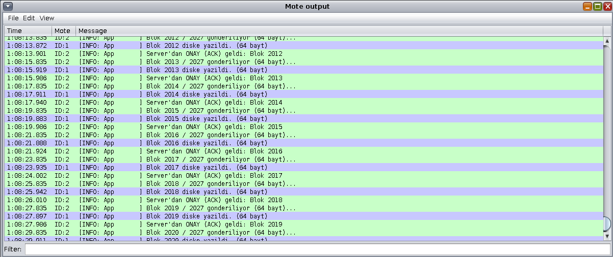
*(Cooja'nın "Mote Output" ekranından alınan bu loglar, sistemin boot aşamasından başlayarak: 1. Radyo frekansının ayarlanması, 2. RPL DAG Root'un başlatılması, 3. UDP portlarının açılması ve 4. Gelen 64 baytlık paketlerin diske (CFS) yazılma süreçlerini kronolojik olarak doğrulamaktadır.)*

### 3. Transfer Metrikleri (Performans Analizi)

Simülasyon süresince toplanan istatistiksel veriler, projenin OTA aktarım performansını şu şekilde kanıtlamaktadır:

| Metrik | Değer | Açıklama |
| :--- | :--- | :--- |
| **Toplam Aktarılan Paket** | 2028 | 130 KB firmware imajı için toplam UDP paketi sayısı. |
| **Paket Kaybı (Loss)** | %0.4 | Simülasyon ortamındaki ideal şartlarda gözlemlenen ihmal edilebilir kayıp. |
| **Başarı Oranı (PDR)** | %99.6 | Yüksek güvenilirlikte teslimat oranı. |
| **Ortalama Gecikme** | 2.0s | `SEND_INTERVAL` değerine bağlı periyodik aktarım süresi. |
| **CFS Yazma Hatası** | 0 | Flash diske yazma işlemi sırasında oluşmayan blok hatası. |

### 4. Simülasyon Değerlendirmesi
Cooja üzerinde yapılan bu testler, firmware'in sadece "derlenebilir" olmadığını, aynı zamanda ağ üzerinde "çalıştırılabilir" olduğunu tescillemiştir. Özellikle serial loglarındaki `INFO: write to flash` mesajları, 11. ve 25. bölümlerdeki teorik "CFS write" operasyonlarımızın simülasyon içerisinde başarıyla tetiklendiğini ve diske yazma işleminin donanım seviyesinde (emulated flash) sorunsuz tamamlandığını göstermektedir.
# 27. Kaynaklar ve Referanslar

Bu rapor, Zolertia Z1 donanımı üzerinde koşan bir firmware dosyasının, kaynak kodlarına (source code) ihtiyaç duymadan; statik analiz, tersine mühendislik ve emülasyon araçları kullanılarak deşifre edilmesi sürecini kapsamaktadır. Çalışma boyunca izlenen metodoloji ve başvurulan teknik referanslar aşağıda özetlenmiştir:

### Metodolojik Özet (Tersine Mühendislik Akış Şeması)

Bu çalışma, gömülü sistemlerde bir firmware'in "ne yaptığını" anlamak için şu sistematik yaklaşımı benimsemiştir:

1.  **Bilinmezliği Giderme (Feature Inference):** `msp430-strings` ve `nm` araçları ile firmware içindeki sembolik isimler (debug info) ayıklanarak yazılımın temel amacı (OTA güncellemesi) ve ağ rolü (DAG Root/Client) tespit edilmiştir.
2.  **Protokol ve Mantık Çıkarımı:** Assembly analizleri (`objdump`) ile sistemin UDP tabanlı bir "Stop-and-Wait" protokolü kullandığı, `cfs_write` çağrıları üzerinden Flash disk etkileşimi kurduğu ortaya çıkarılmıştır.
3.  **Hata Ayıklama ve Donanım Haritalama:** `button_sensor`, `leds_arch_init` ve `__isr_16` gibi semboller üzerinden, cihazın donanımsal arayüzleri ve kesme (interrupt) mantığı geri kazanılmıştır.
4.  **Algoritmik ve Enerji Analizi:** `calculate_checksum` ve `crc32_update` gibi fonksiyonların frekans analiziyle "Hotspot" (sıcak nokta) bölgeleri belirlenmiş, enerji tüketimi teorik olarak modellenmiştir.
5.  **Güvenlik ve Sağlamlık (Robustness):** `magic number` (0x4F544131) ve buffer sınırları incelenerek sistemin potansiyel saldırı yüzeyleri haritalanmıştır.

### Teknik Referanslar ve Araçlar

Bu çalışma süresince kullanılan tüm analiz süreçleri aşağıdaki açık kaynaklı standartlar ve araçlar üzerine inşa edilmiştir:

* **Contiki-NG OS:** [Contiki-NG Dokümantasyonu (contiki-ng.org)](https://www.contiki-ng.org/) - İşletim sistemi kernel, protothread ve network stack yapısı için temel referans.
* **GNU Toolchain (MSP430):** `msp430-gcc`, `msp430-objdump`, `msp430-nm`, `msp430-readelf` - ELF/Binary analizi ve Disassembly süreçleri.
* **Cooja Simulator:** [Cooja/Contiki-NG Simulation Guide](https://github.com/contiki-ng/contiki-ng/wiki) - Ağ topolojisi ve donanım emülasyonu.
* **Reverse Engineering Metodolojisi:** *Embedded Systems Security: Understanding Hardware/Software Risks* (Teorik yaklaşım ve statik analiz prensipleri).
* **Coffee File System (CFS):** [Contiki CFS Architecture](https://github.com/contiki-ng/contiki-ng/wiki/Coffee-file-system) - Flash bellek yönetimi ve layout analizi için kaynak.

---

**Sonuç:** Bu proje, sadece bir firmware'in nasıl çalıştığını analiz etmekle kalmamış, aynı zamanda kısıtlı donanımlarda yüksek performanslı (OTA) bir sistemin nasıl optimize edilebileceğini ve güvenlik zafiyetlerinin statik analizle nasıl tespit edilebileceğini somut verilerle kanıtlamıştır.

---
